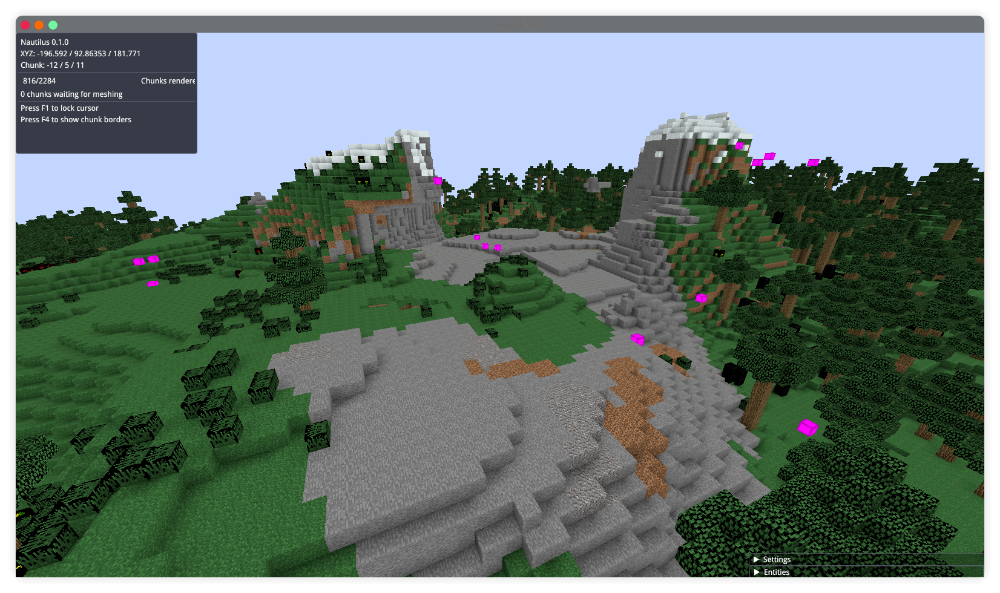

# 🦀 MineCrab/Nautilus

MineCrab is a Minecraft client written in Rust+WGPU, capable of connecting to official servers, or [any other compatible server](https://wiki.vg/Server_List)

```diff
- ! Code quality is abysmal as of right now, restructuring is in progress
```



## Supported versions

MineCrab currently only supports 1.7.10, but I'm aiming to support every major version from 1.7 to the latest version (which is 1.19.2 as of writing this).

Every version has 3 degrees of support:

- Min: basic support for most major features and packets (movement, chunk loading, chat)
- Med: supporting all the protocol packets, but not (fully) integrated into the game _yet_
- Full: support for every packet, fully integrated, players can expect the best support for this version

| Version | Min | Med | Full |
| ------- | --- | --- | ---- |
| 1.7     | ✅  | ✅  | ❌   |
| 1.9     | ❌  | ❌  | ❌   |
| 1.13    | ❌  | ❌  | ❌   |
| 1.16    | ❌  | ❌  | ❌   |
| 1.19    | ❌  | ❌  | ❌   |

## Features

- [ ] Networking
  - [ ] Compression
  - [ ] Encryption (online-mode)
  - [ ] Multi-protocol abstraction system
- [ ] Rendering
  - [x] Basic rendering
  - [ ] Occlusion culling
  - [x] Frustum culling
  - [ ] Anti-aliasing
  - [ ] Biomes
  - [ ] Chunk animations
  - [ ] Non-cube models (torches, plants, etc)
  - [ ] Entity models
  - [ ] Texture animations
  - [ ] GUI
  - [ ] Optifine/Sodium shader support
- [ ] GUI
  - [ ] Survival inventory
  - [ ] Creative inventory
  - [ ] Furnace
  - [ ] Crafting table
  - [ ] Enchanting table
  - [ ] Anvil
  - [ ] Sign editor
  - [ ] Chat
- [ ] Sound
- [ ] Plugin system
  - [ ] Basics
  - [ ] Example plugins
    - [ ] Nether ceiling tool
    - [ ] X-ray
- [ ] Input
  - [ ] Mouse input
  - [ ] Input settings

## Credits

- Mojang for making an amazing game
- [wiki.vg](https://wiki.vg/Main_Page) for the protocol documentation
